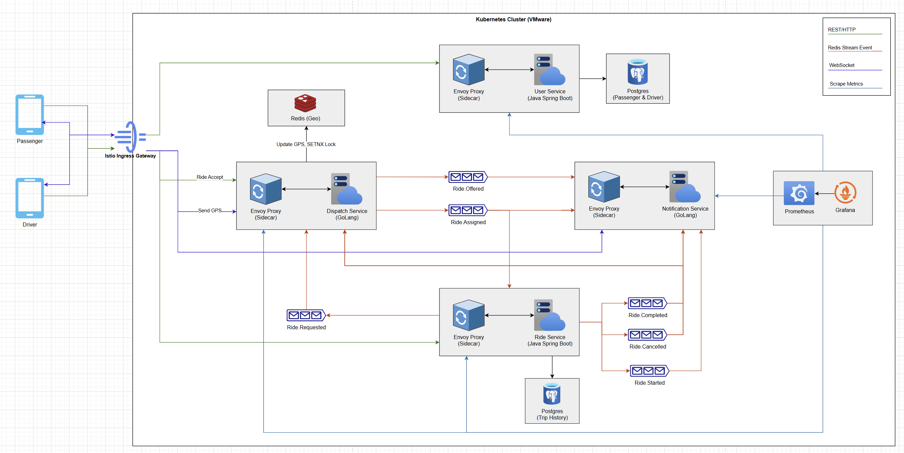
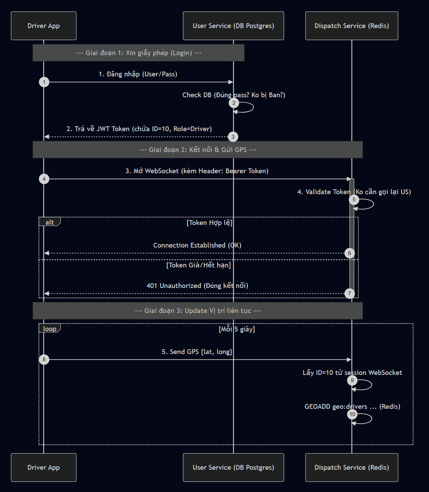
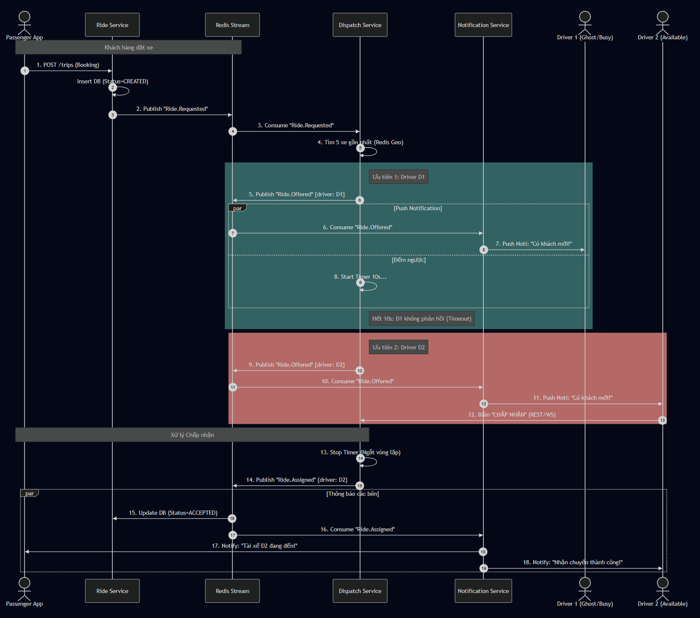
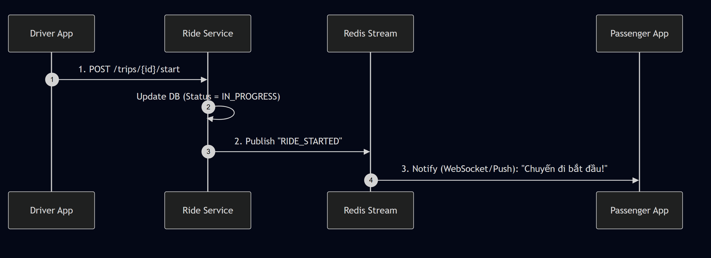
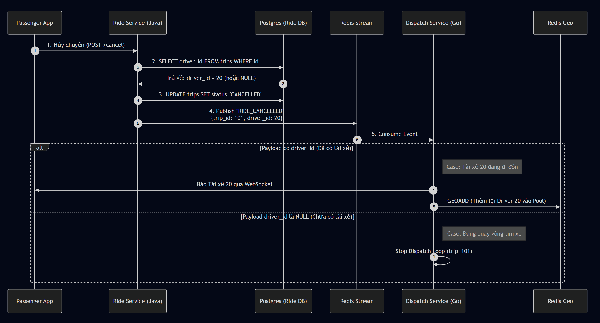
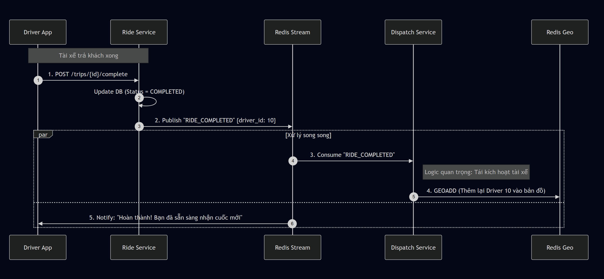

# BÁO CÁO THIẾT KẾ & TRIỂN KHAI HỆ THỐNG

**Dự án:** Microservices Ride-Hailing MVP (Mô hình Đặt xe)

**Kiến trúc:** Event-Driven Microservices với Kubernetes, Istio Service Mesh & Redis Streams

---

## MỤC LỤC

1. [TỔNG QUAN DỰ ÁN](#1-tổng-quan-dự-án)
2. [KIẾN TRÚC HỆ THỐNG](#2-kiến-trúc-hệ-thống)
3. [CÔNG NGHỆ SỬ DỤNG](#3-công-nghệ-sử-dụng)
4. [CHI TIẾT TRIỂN KHAI](#4-chi-tiết-triển-khai)
   - 4.1. [Hạ tầng & Quản trị Tài nguyên (IaC)](#41-hạ-tầng--quản-trị-tài-nguyên-iac)
   - 4.2. [Chiến lược Quản lý Pod](#42-chiến-lược-quản-lý-pod)
5. [LUỒNG NGHIỆP VỤ CHÍNH](#5-luồng-nghiệp-vụ-chính)
   - 5.1. [Luồng Xác thực & Định vị GPS](#51-luồng-xác-thực--định-vị-gps)
   - 5.2. [Luồng Đặt xe & Gán cuốc Tuần tự (Waterfall)](#52-luồng-đặt-xe--gán-cuốc-tuần-tự-waterfall-dispatching)
   - 5.3. [Các sự kiện Vòng đời chuyến đi](#53-các-sự-kiện-vòng-đời-chuyến-đi)
6. [QUY TRÌNH CI/CD PIPELINE](#6-quy-trình-cicd-pipeline)
7. [CHIẾN LƯỢC GIÁM SÁT & CHỊU LỖI](#7-chiến-lược-giám-sát--chịu-lỗi)

---

## 1. TỔNG QUAN DỰ ÁN

### 1.1. Mục tiêu

Xây dựng hệ thống Backend cho ứng dụng đặt xe (Ride-hailing) theo kiến trúc **Microservices hướng sự kiện (Event-Driven)**, giải quyết các bài toán về xử lý thời gian thực và chịu tải cao. Dự án áp dụng các chuẩn mực DevOps hiện đại như Infrastructure as Code (IaC), Container Orchestration (K8s) và Service Mesh (Istio).

### 1.2. Phạm vi MVP (Minimum Viable Product)

Hệ thống tập trung vào các chức năng cốt lõi:

- **Quản lý Định danh:** Xác thực bảo mật qua JWT (RS256).
- **Quản lý Vòng đời Chuyến đi:** Theo dõi và xử lý chặt chẽ các trạng thái chuyến đi (Requested, Accepted, In-progress, Cancelled, Completed) để đảm bảo tính nhất quán của dữ liệu giao dịch.
- **Điều phối Waterfall Dispatching:** Thuật toán gán cuốc tuần tự dựa trên vị trí không gian (Geo-spatial), giúp tối ưu hóa việc phân bổ tài xế, loại bỏ tình trạng tranh giành cuốc xe (Race Condition) và xử lý vấn đề tài xế ảo (Ghost Driver).
- **Giao tiếp:** Mọi giao tiếp liên dịch vụ đều thông qua **Redis Stream**.

---

## 2. KIẾN TRÚC HỆ THỐNG

### 2.1. Sơ đồ Kiến trúc Tổng thể

Hệ thống được thiết kế dựa trên 4 dịch vụ chính (User, Ride, Dispatch, Notification) vận hành trên Kubernetes Cluster. **Redis Stream** đóng vai trò trục xương sống (Backbone) truyền tải dữ liệu bất đồng bộ, trong khi **Istio Ingress Gateway** quản lý toàn bộ traffic đi vào.

_Hình 2.1: Sơ đồ kiến trúc Event-Driven Microservices trên hạ tầng Kubernetes/VMware._

### 2.2. Phân rã Microservices

| Service                  | Công nghệ          | Vai trò & Trách nhiệm (Input/Output)                                                                                                                                                                                                                                                                                                                                                                                                                                                                          |
| :----------------------- | :----------------- | :------------------------------------------------------------------------------------------------------------------------------------------------------------------------------------------------------------------------------------------------------------------------------------------------------------------------------------------------------------------------------------------------------------------------------------------------------------------------------------------------------------ |
| **User Service**         | Java (Spring Boot) | - **Identity Provider:** Quản lý User/Driver Profile và Database Postgres riêng biệt. - **Input:** Request đăng nhập từ Envoy Proxy. - **Output:** Thông tin User profile cho các service khác.                                                                                                                                                                                                                                                                                                         |
| **Ride Service**         | Java (Spring Boot) | - **Lifecycle Manager:** Quản lý trạng thái chuyến đi (Source of Truth) và lưu trữ lịch sử vào Postgres. - **Event Publisher:** Phát sinh các sự kiện vào Redis Stream: `Ride.Requested`, `Ride.Started`, `Ride.Completed`, `Ride.Cancelled`.                                                                                                                                                                                                                                                              |
| **Dispatch Service**     | Go (Golang)        | - **Real-time & Geo Engine:** Xử lý kết nối WebSocket GPS và cập nhật vị trí vào Redis Geo. - **Driver Pool Management:** Quản lý trạng thái Rảnh/Bận bằng cách thêm/xóa tài xế khỏi Redis Geo (Thay vì dùng Lock). - **Logic Dispatch:** &nbsp;&nbsp;+ Consume `Ride.Requested` để tìm tài xế. &nbsp;&nbsp;+ Consume `Ride.Completed`, `Ride.Cancelled` để đưa tài xế trở lại Redis Geo pool, giúp họ sẵn sàng nhận các cuốc xe mới. &nbsp;&nbsp;+ Publish `Ride.Offered` và `Ride.Assigned`. |
| **Notification Service** | Go (Golang)        | - **Communication Hub:** Trung tâm thông báo hợp nhất, lắng nghe sự kiện từ Redis Stream để đẩy xuống Client (Driver/Passenger) qua WebSocket/Push. - **Event Consumer:** Xử lý `Ride.Offered`, `Ride.Assigned`, `Ride.Started`, `Ride.Completed`, `Ride.Cancelled`.                                                                                                                                                                                                                                       |
| **Envoy Proxy**          | C++ (Istio)        | - **Sidecar:** Chạy song song với mỗi Service, chặn bắt (Intercept) traffic để thực hiện mTLS, Load Balancing và expose Metrics cho Prometheus thu thập.                                                                                                                                                                                                                                                                                                                                                      |

---

## 3. CÔNG NGHỆ SỬ DỤNG

- **Hạ tầng & IaC:** VMware Workstation, Vagrant.
- **Orchestration:** Kubernetes (K8s) Cluster.
- **Service Mesh:** Istio (Envoy Proxy Sidecar, mTLS, Gateway).
- **Backend:** Java 17 (Spring Boot), Go 1.21.
- **Database:** PostgreSQL (Persistence), Redis (In-memory, Geo, Streams).
- **Monitoring:** Prometheus, Grafana.

---

## 4. CHI TIẾT TRIỂN KHAI

### 4.1. Hạ tầng & Quản trị Tài nguyên (IaC)

#### 4.1.1. Mô hình triển khai

Dự án áp dụng quy trình **Infrastructure as Code (IaC)** để tự động hóa việc xây dựng môi trường Lab trên máy cá nhân:

- **Vagrant**: Tự động cấp phát 3 máy ảo (VM) và thiết lập mạng nội bộ (Static IP).
- **Ansible**: Tự động cài đặt các thành phần K8s (Containerd, Kubeadm, Kubelet) ngay khi VM khởi động, đảm bảo tính nhất quán (Idempotency) khi tái lập môi trường.

#### 4.1.2. Phân bổ phần cứng

Với cấu hình Host (Intel Core i5-13500H, 16GB RAM), cụm Cluster được thiết kế tối thiểu để vận hành ổn định Istio Service Mesh:

| Node             | Vai trò       | Cấu hình (vCPU / RAM) | Mục đích sử dụng                                          |
| :--------------- | :------------ | :-------------------- | :-------------------------------------------------------- |
| **k8s-master**   | Control Plane | 2 / 4 GB              | Chịu tải cho K8s System và Istio Control Plane (istiod).  |
| **k8s-worker-1** | Data Plane    | 2 / 4 GB              | Chạy các dịch vụ nặng (Java Spring Boot, Postgres).       |
| **k8s-worker-2** | Data Plane    | 2 / 4 GB              | Chạy các dịch vụ nhẹ (GoLang, Redis) và Monitoring Stack. |
| **Host Reserve** | Windows       | 4 / 4 GB              | Duy trì OS chính và IDE.                                  |

### 4.2. Chiến lược Quản lý Pod

Để tối ưu hóa tài nguyên hạn chế, các Pod được cấu hình chặt chẽ thông qua Resource Quotas và Scheduling:

- **Resource Requests/Limits**:
  - **Java Services (Ride/User)**: Request RAM 512Mi (do đặc thù JVM cần bộ nhớ khởi động lớn).
  - **Go Services (Dispatch/Noti)**: Request RAM 64Mi (tối ưu, nhẹ).
  - **Sidecar Proxy**: Tự động inject (~100Mi/Pod).
- **High Availability (HA)**:
  - Cấu hình replicas: 2 cho các Core Service (Ride, Dispatch).
  - Tận dụng cơ chế **Anti-affinity** của K8s để phân tán các bản sao ra các Node khác nhau, đảm bảo hệ thống vẫn phản hồi khi giả lập tắt 1 Worker Node.

---

## 5. LUỒNG NGHIỆP VỤ CHÍNH

### 5.1. Luồng Xác thực & Định vị GPS

Hệ thống sử dụng cơ chế **Stateless Authentication** với JWT (thuật toán RS256).

- **Xác thực:** User Service cấp Token. Các Service khác (Dispatch, Ride) và Istio Gateway chỉ cần dùng Public Key để xác thực, không cần gọi ngược về User Service (giảm độ trễ).
- **Định vị:** `Dispatch Service` nhận tọa độ GPS từ tài xế qua WebSocket và cập nhật trực tiếp vào **Redis Geo** (In-memory) để phục vụ tra cứu siêu tốc, không ghi xuống đĩa cứng (DB).

_Hình 5.1: Biểu đồ tuần tự luồng Đăng nhập (Login) và Cập nhật vị trí (GPS Update)._

### 5.2. Luồng Đặt xe & Gán cuốc Tuần tự (Waterfall Dispatching)

Đây là nghiệp vụ phức tạp nhất của hệ thống, được thiết kế để loại bỏ tình trạng tranh chấp (Race Condition) và xử lý tài xế ảo (Ghost Driver).

**Cơ chế hoạt động:**

1. **Tiếp nhận:** `Ride Service` nhận yêu cầu, lưu DB và bắn sự kiện `Ride.Requested` vào Redis Stream.
2. **Điều phối (Dispatch):** `Dispatch Service` tiêu thụ sự kiện, tìm 5 tài xế gần nhất từ Redis Geo.
3. **Vòng lặp Waterfall:**

- Hệ thống gửi lời mời (`Ride.Offered`) tới tài xế gần nhất (Ưu tiên 1) thông qua `Notification Service`.
- Kích hoạt bộ đếm ngược (Timer) 10 giây.
- Nếu tài xế từ chối hoặc hết giờ (Timeout), hệ thống tự động chuyển sang tài xế tiếp theo.

4. **Chấp nhận:** Khi tài xế bấm "Nhận", `Dispatch Service` ngắt vòng lặp và bắn sự kiện `Ride.Assigned`.

_Hình 5.2: Cơ chế Waterfall Dispatching - Gán cuốc tuần tự và xử lý Timeout._

### 5.3. Các sự kiện Vòng đời chuyến đi

Để đảm bảo tính nhất quán dữ liệu giữa **Trạng thái chuyến đi** (Postgres - Ride Service) và **Trạng thái tài xế** (Redis Geo - Dispatch Service), hệ thống xử lý các sự kiện sau:

#### A. Bắt đầu Chuyến đi (Trip Start)

Khi tài xế đón được khách, trạng thái chuyến đi chuyển sang `IN_PROGRESS`. `Dispatch Service` không cần can thiệp nhiều, nhưng `Notification Service` sẽ báo cho khách hàng biết.

_Hình 5.3: Luồng cập nhật trạng thái Bắt đầu chuyến đi._

#### B. Hủy Chuyến (Trip Cancellation)

Đây là kịch bản phức tạp cần xử lý dựa trên dữ liệu thực tế:

- `Ride Service` truy vấn DB để kiểm tra xem chuyến đi đã có tài xế nhận hay chưa.
- Sự kiện `RIDE_CANCELLED` được bắn đi kèm theo `driver_id` (nếu có).
- `Dispatch Service` dựa vào payload này để quyết định:
  - Nếu chưa có tài xế: Ngừng vòng lặp tìm kiếm.
  - Nếu đã có tài xế: Báo cho tài xế và **đưa tài xế trở lại Redis Geo** ngay lập tức.

_Hình 5.4: Logic xử lý Hủy chuyến và giải phóng tài xế._

#### C. Hoàn thành Chuyến đi (Trip Completion)

Khi chuyến đi kết thúc:

1. `Ride Service` đóng hồ sơ chuyến đi (`COMPLETED`).
2. `Dispatch Service` nhận sự kiện và thực hiện lệnh `GEOADD` để **tái kích hoạt tài xế** vào bản đồ, giúp họ sẵn sàng nhận cuốc xe tiếp theo.

_Hình 5.5: Luồng Hoàn thành chuyến đi và đưa tài xế trở lại hàng đợi (Driver Pool)._

---

## 6. QUY TRÌNH CI/CD PIPELINE

Quy trình tự động hóa khép kín từ mã nguồn đến hạ tầng thực tế:

1. **Commit:** Developer đẩy code lên GitHub.
2. **CI (Integration):** GitHub Actions chạy Unit Test, build Docker Image (sử dụng Multi-stage build để tối ưu kích thước).
3. **Registry:** Đẩy Image lên Docker Hub / GHCR.
4. **CD (Deployment):** Tự động cập nhật Deployment trên K8s cluster.
5. **Zero-downtime:** Kubernetes thực hiện **Rolling Update**, đảm bảo dịch vụ không bị gián đoạn khi cập nhật phiên bản mới.

---

## 7. CHIẾN LƯỢC GIÁM SÁT & CHỊU LỖI

### 7.1. Giám sát (Monitoring)

Hệ thống sử dụng mô hình **Pull-based Monitoring**:

- **Prometheus Server:** Định kỳ "cào" (Scrape) dữ liệu metrics từ các **Envoy Sidecar** (nằm cạnh mỗi Service). Các chỉ số bao gồm: Request rate, Error rate (4xx/5xx), Latency và Resource usage (CPU/RAM).
- **Grafana:** Kết nối tới Prometheus để hiển thị các Dashboard trực quan, giúp đội vận hành phát hiện sớm sự cố.

### 7.2. Khả năng chịu lỗi (Fault Tolerance)

- **Redis Stream Persistence:** Đảm bảo không mất đơn hàng. Nếu `Dispatch Service` gặp sự cố, các sự kiện `Ride.Requested` vẫn được lưu giữ trong Stream và sẽ được xử lý lại (Retry) ngay khi Service phục hồi.
- **Timeout Logic:** Xử lý triệt để vấn đề "Ghost Driver" (Tài xế mất mạng). Nếu gửi lời mời mà không thấy phản hồi sau 10s, hệ thống tự động bỏ qua và tìm người khác, tránh treo đơn hàng.
