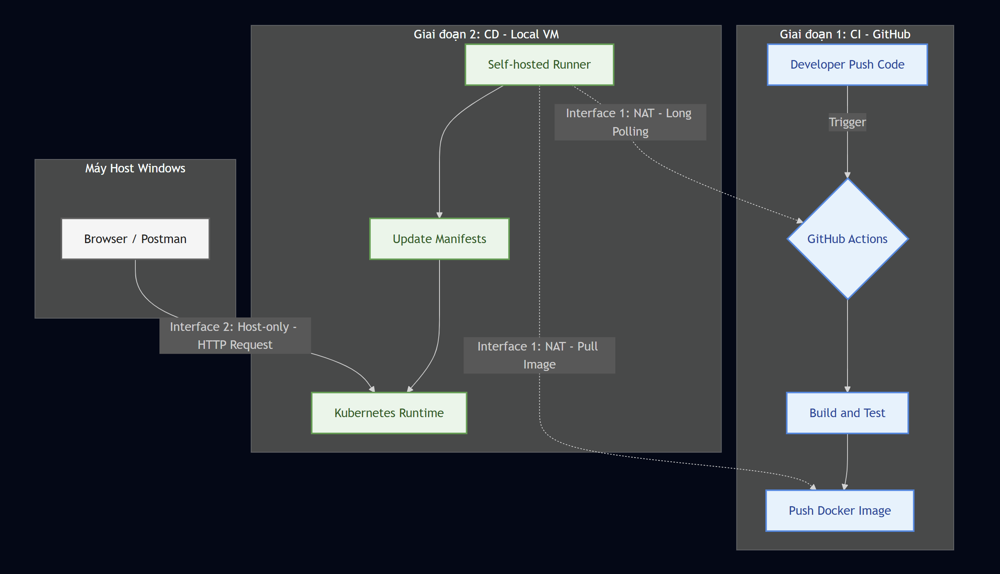

# KẾ HOẠCH TRIỂN KHAI CI/CD: MÔ HÌNH HYBRID NETWORK

**Dự án:** Ride-Hailing Backend MVP  

---

## MỤC LỤC

1. [MỤC TIÊU](#1-mục-tiêu)
2. [CHIẾN LƯỢC HẠ TẦNG & MẠNG](#2-chiến-lược-hạ-tầng--mạng)
   - 2.1. [Phân hoạch mạng](#21-phân-hoạch-mạng-network-segmentation)
   - 2.2. [Nền tảng Container Orchestration](#22-nền-tảng-container-orchestration)
3. [THIẾT KẾ PIPELINE CI/CD](#3-thiết-kế-pipeline-cicd)
   - 3.1. [Sơ đồ vận hành hệ thống](#31-sơ-đồ-vận-hành-hệ-thống-operational-workflow)
   - 3.2. [Chi tiết các giai đoạn](#32-chi-tiết-các-giai-đoạn)
4. [KẾ HOẠCH TRIỂN KHAI](#4-kế-hoạch-triển-khai)

---

## 1. MỤC TIÊU

Xây dựng hệ thống tự động hóa quy trình CI/CD đáp ứng các tiêu chuẩn kỹ thuật sau:

1. **Cô lập mạng (Network Isolation):** Vận hành trong môi trường máy ảo nằm sau NAT, không có Public IP.
2. **Mô hình Hybrid:** Kết hợp tài nguyên Cloud (Build/Test) và Local (Deploy) để tối ưu hiệu năng.
3. **Bảo mật ưu tiên:** Mã nguồn và dịch vụ quản trị chỉ được truy cập từ mạng nội bộ.

---

## 2. CHIẾN LƯỢC HẠ TẦNG & MẠNG

Hệ thống CI/CD được xây dựng dựa trên đặc thù của **2 Network Interfaces** riêng biệt trên máy ảo.

### 2.1. Phân hoạch mạng (Network Segmentation)

| Interface | Loại kết nối | Vai trò trong luồng CI/CD | Luồng dữ liệu (Traffic Flow) |
|-----------|--------------|----------------------------|-------------------------------|
| **Interface 1** | **NAT** (Internet Access) | **Kênh vận chuyển (Transport Layer):**  Đóng vai trò là "cửa ngõ" một chiều để Self-hosted Runner giao tiếp với thế giới bên ngoài. | **Outbound Only:**  • VM → GitHub (Polling Jobs để nhận lệnh) • VM → Docker Registry (Pull Images về máy) • VM → Package Repos (Tải gói cài đặt/Update OS) |
| **Interface 2** | **Host-only** (Internal) | **Kênh quản trị & Kiểm thử (Management Layer):**  Đóng vai trò là mạng nội bộ (Private LAN), nơi ứng dụng thực sự hoạt động và phục vụ người dùng. | **Inbound/Internal:**  • Developer → VM (SSH quản trị) • Browser → Web App (Kiểm thử chức năng) • Kubernetes Node ↔ Node (Giao tiếp nội bộ) |

### 2.2. Nền tảng Container Orchestration

Hệ thống sẽ được triển khai trên nền tảng **Kubernetes**.

- **Lựa chọn Runtime:** Sử dụng bản phân phối Kubernetes tối ưu cho tài nguyên hạn chế, vẫn đảm bảo tương thích 100% với các API chuẩn (Deployment, Service, StatefulSet).
- **Chiến lược tài nguyên:** Ưu tiên RAM cho Application Pods và Database, giảm thiểu tài nguyên cho Control Plane.

---

## 3. THIẾT KẾ PIPELINE CI/CD

Quy trình sử dụng mô hình **Hybrid Cloud**, tận dụng Self-hosted Runner làm cầu nối giữa Internet và mạng nội bộ.

### 3.1. Sơ đồ vận hành hệ thống (Operational Workflow)

Dưới đây là mô hình luồng dữ liệu di chuyển qua các vùng mạng khác nhau (Cloud, NAT, Local):

### 3.2. Chi tiết các giai đoạn

#### Giai đoạn 1: Continuous Integration (CI) - Cloud Based

*Môi trường: GitHub Hosted Runner (ubuntu-latest)*

**Điều kiện kích hoạt (Triggers):**

- **Pull Request (vào nhánh `main`):** Chỉ chạy các bước kiểm tra (Lint, Unit Test) để đảm bảo chất lượng code trước khi merge. Không thực hiện đóng gói và publish.

- **Push (vào nhánh `main`):** Chạy đầy đủ quy trình (Test → Build → Push Image) để chuẩn bị cho deploy.

- **Manual Dispatch:** Cấu hình sự kiện `workflow_dispatch` để hiển thị nút chạy thủ công trên giao diện GitHub (dùng cho trường hợp cần chạy lại build cũ).

**Hoạt động chính:**

- **Linting & Static Analysis:** Kiểm tra cú pháp và Style code.
- **Unit Testing:** Chạy kiểm thử tự động.
- **Packaging** *(Chỉ chạy khi Push Main):* Đóng gói ứng dụng thành Docker Image (Multi-stage build).
- **Publish** *(Chỉ chạy khi Push Main):* Đẩy Image lên Registry trung tâm.

#### Giai đoạn 2: Continuous Deployment (CD) - Local Based

*Môi trường: Self-hosted Runner (VMware VM)*

**Điều kiện kích hoạt (Triggers):**

- **Workflow Run:** Tự động kích hoạt ngay sau khi Giai đoạn 1 (CI) hoàn tất thành công trên nhánh `main`. *(Không chạy khi có Pull Request)*.

**Cơ chế kết nối:** 

Runner sử dụng kỹ thuật **Long Polling** qua giao diện NAT để nhận lệnh từ GitHub, bỏ qua rào cản Firewall.

**Hoạt động chính:**

- **Pull Artifact:** Tải cấu hình Deployment (.yaml) mới nhất.
- **Update Configuration:** Cập nhật tag Image mới nhất vào file cấu hình.
- **Apply to Cluster:** Thực thi lệnh update vào Kubernetes.
- **Health Check:** Verify ứng dụng đã chạy ổn định thông qua IP Host-only.

---

## 4. KẾ HOẠCH TRIỂN KHAI

### Phase 1: Xây dựng Hạ tầng & Mạng

- Thiết lập máy ảo với 2 Network Interfaces.
- Kiểm tra kết nối: Đảm bảo NAT ra được Internet và Host-only ping được từ máy Host.
- Cài đặt Kubernetes và các công cụ nền tảng.

### Phase 2: Kết nối Pipeline Core

- Cài đặt GitHub Runner Agent vào VM.
- Thiết lập luồng kết nối Runner → GitHub qua NAT.
- Thực hiện deploy thử nghiệm dịch vụ đơn giản để chứng minh luồng CI/CD hoạt động.

### Phase 3: Tích hợp Toàn hệ thống

- Áp dụng Pipeline cho các Backend Services chính.
- Thiết lập Stateful Services (Database) trong Cluster.
- Kiểm thử truy cập ứng dụng từ trình duyệt máy Host thông qua IP Host-only.